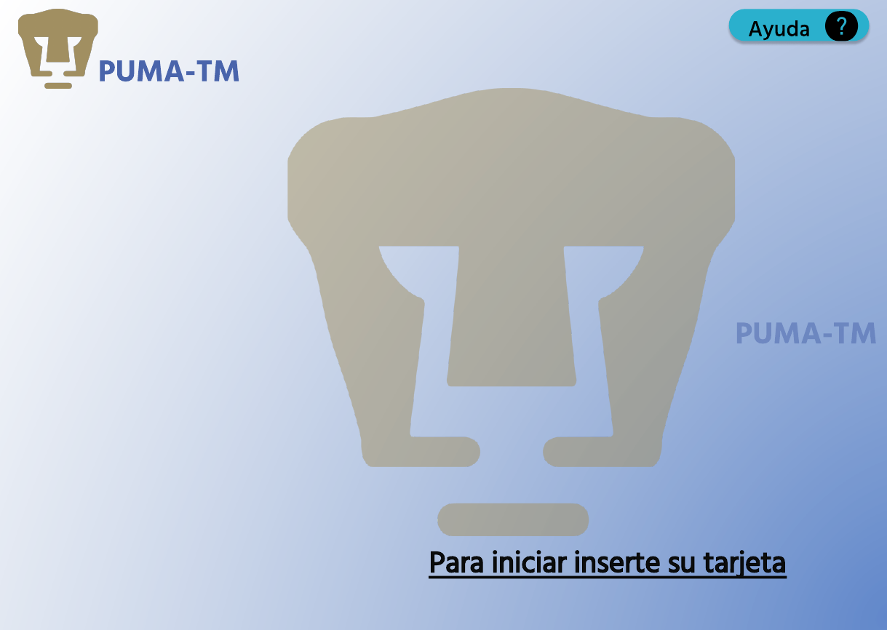
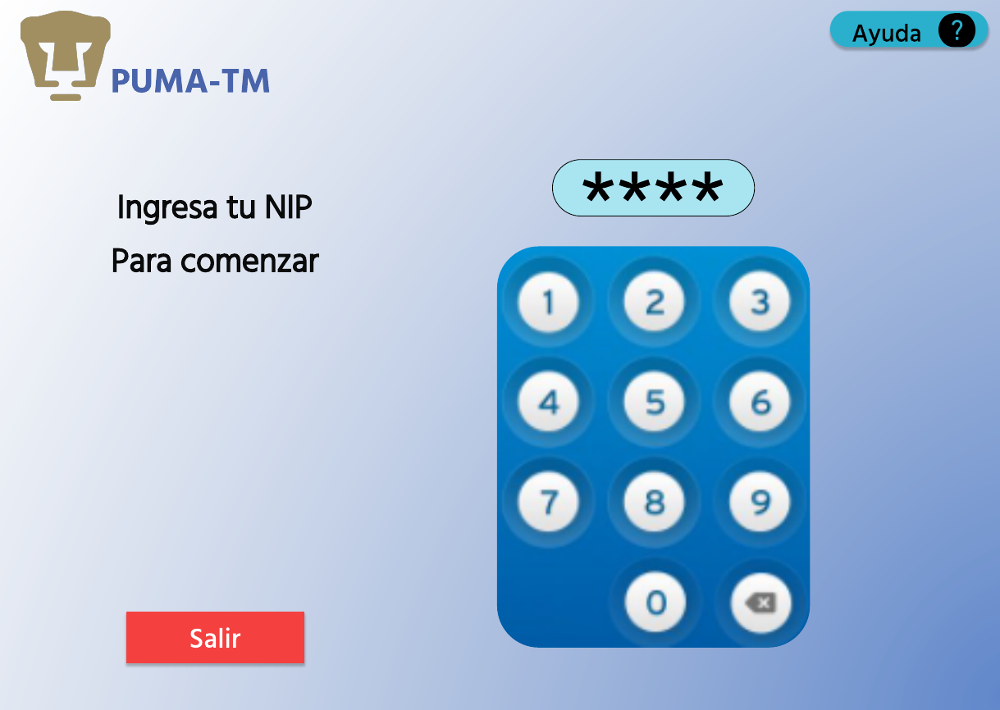
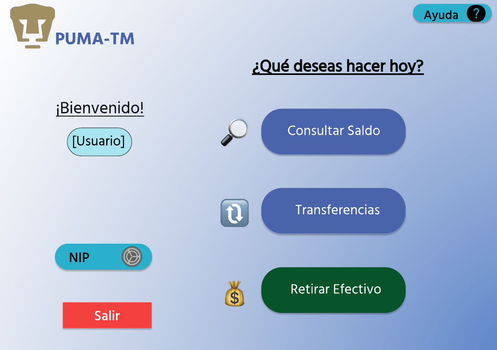
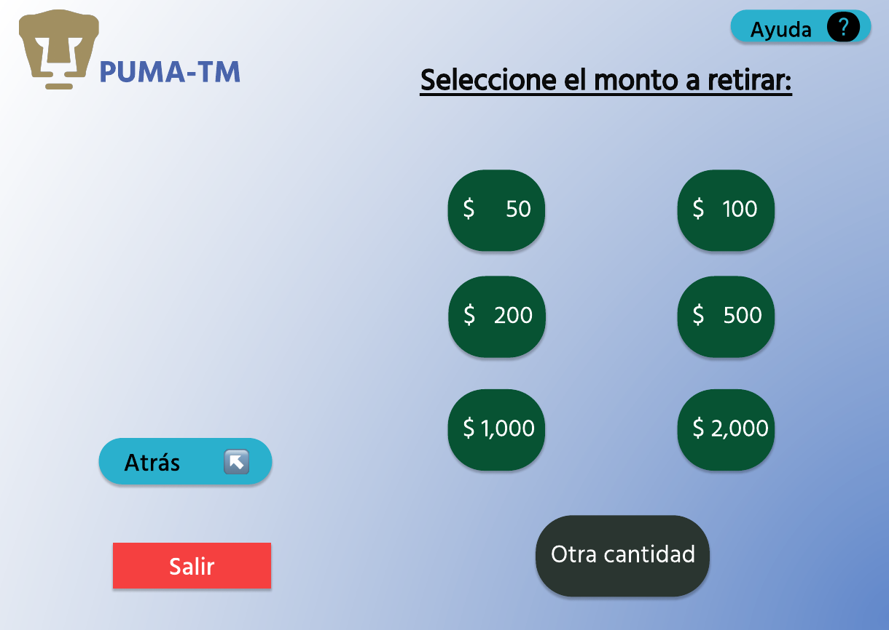
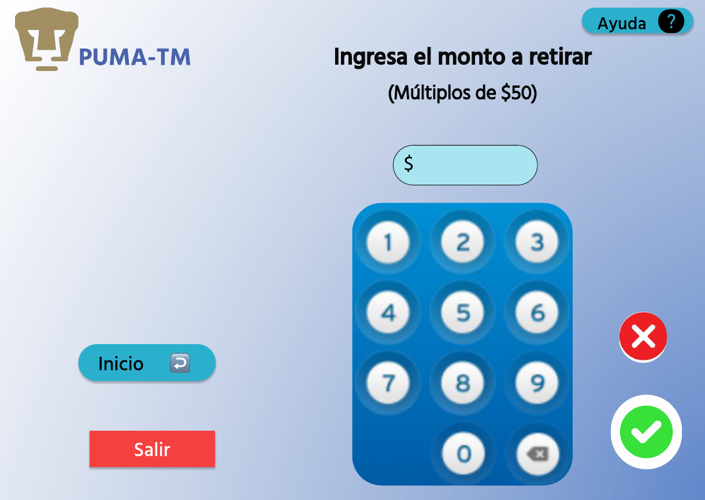
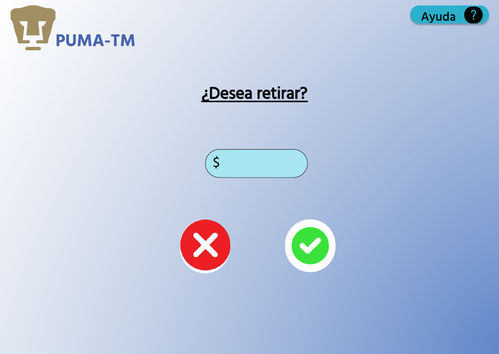
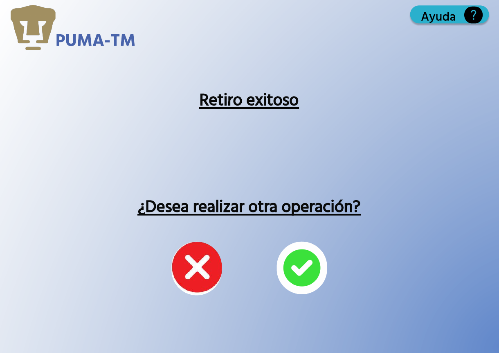
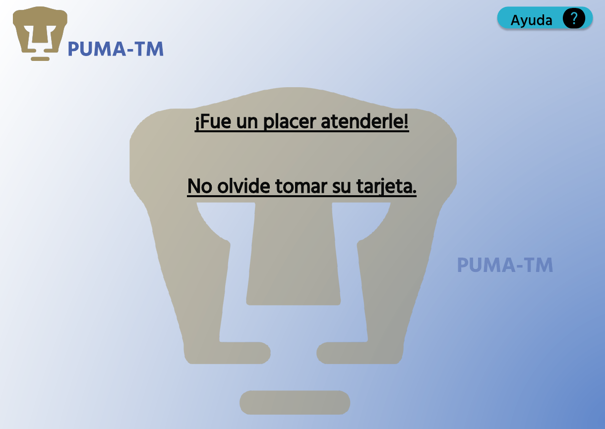

Programación de Dispositivos Móviles 2023-2
---

Profesor
: Gustavo Arturo Márquez Flores

Ayudantes
: Teoría
    : Ilse Gisela Suárez Peña
Francisco Javier Ortíz Medrano

: Laboratorio
    : Jesús Iván Saavedra Martínez
    Fernando Antonio Sánchez Montoya

[Camacho Sosa Fernando](mailto:fcamachos@ciencias.unam.mx)
: 305262550

---
# Práctica 1

Al llegar al cajero automático *PUMA-TM* encontraremos la siguiente pantalla de espera. 
## StandBy Screen

Al ingresar nuestra tarjeta bancaria nos aparecerá la siguiente pantalla:

## Start Screen

> Nótese que se da un *feedback* sobre la cantidad de dígitos que ha ingresado el ***Usuario***, sin mostrar los dígitos ingresados. 

Al ingresar correctamente el NIP, se mostrará la siguiente pantalla:

## Home Screen

Después de seleccionar el botón *Retirar Efectivo* se muestra la siguiente pantalla:

## Withdraw Screen

En esta pantalla el ***Usuario*** puede seleccionar en alguno de los botones las opciones más comunes para retiro, o si lo prefiere, ingresar un monto de manera manual:

## WithdrawManual Screen

> El programa debe poder evitar que el ***Usuario*** ingrese una cantidad que no sea un múltiplo de 50.

El botón rojo debería regresar al ***Usuario*** a la [pantalla anterior](#withdraw-screen). Mientras que el botón *Inicio* debe mandar al ***Usuario*** a la [pantalla principal](#home-screen). 

Una vez que el ***Usuario*** da click al botón verde se le muestra una ventana de confirmación:

## WithdrawConfirmation Screen

El ***Usuario*** verá la cantidad de dinero seleccionada y sólo podrá interactuar con el botón de *Cancelar* y el botón de *Confirmar*. 

El botón *Cancelar*, deberá llevar al ***Usuario*** a la [pantalla principal](#home-screen), mientras que el botón *Confirmar* deberá llevarlo a la siguiente pantalla:

## WithdrawSuccess Screen

Si el ***Usuario*** decide realizar otra operación, será enviado a la [pantalla principal](#home-screen). Pero si decide no realizar otra operación, será enviado a la siguiente pantalla:

## End Screen
