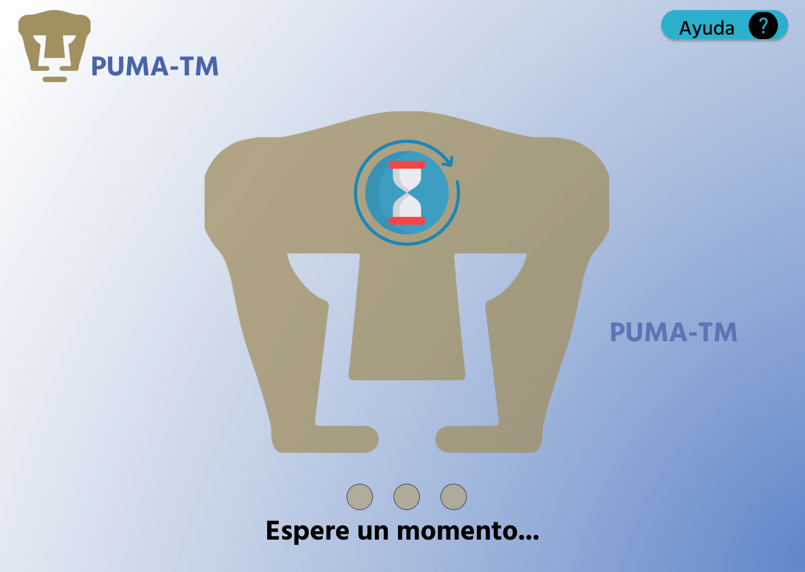

Programación de Dispositivos Móviles 2023-2
---

Profesor
: Gustavo Arturo Márquez Flores

Ayudantes
: Teoría
    : Ilse Gisela Suárez Peña
Francisco Javier Ortíz Medrano

: Laboratorio
    : Jesús Iván Saavedra Martínez
    Fernando Antonio Sánchez Montoya

[Camacho Sosa Fernando](mailto:fcamachos@ciencias.unam.mx)
: 305262550

---
# Práctica 2

>Se toma en consideración que la mayoría de *Usuarios* son **diestros**, por lo tanto, la posición de los **botones de confirmación** está orientada favorablemente hacia la parte **inferior derecha** de la pantalla, mientras que los **botones de cancelación** se encuentran más hacia **arriba y a la izquierda** según la pantalla. 

Al llegar al cajero automático *PUMA-TM* encontraremos la siguiente pantalla de espera. 
## StandBy Screen

Al ingresar nuestra tarjeta bancaria nos aparecerá la siguiente pantalla:

## Start Screen

> Nótese que se da un *feedback* sobre la cantidad de dígitos que ha ingresado el ***Usuario***, sin mostrar los dígitos ingresados. 

Tenemos 3 botones típicos de un cajero, *Cancelar*, *Limpiar* y *Aceptar*, 
el botón *Cancelar* regresará al *Usuario* a la ventana de [*StandBy*](#standby-screen). 

El botón *Limpiar* borrará todos los dígitos ingresados en el *NIP*.

El botón *Aceptar* confirma la solicitud del *Usuario* de acceder. En caso de ingresar un *NIP* incorrecto, se deberá mostrar un *FeedBack* de inicio incorrecto y **bloquear** la tarjeta al **tercer** intento erróneo. 

Al ingresar correctamente el NIP, se mostrará la siguiente pantalla:

## Loading

Esta ventana se mostrará cada vez que el sistema realice una acción de consulta para dar un *FeedBack* al usuario de que el sistema sigue funcionando. 
Cabe destacar que el botón **Ayuda** debe continuar activo para solicitar el apoyo del personal del banco. 

## Home Screen

En esta pantalla notemos que se muestra el saldo oculto, si el *Usuario* presiona el ícono ***"Mostrar"*** denotado por un **[ojo]**, se mostrará el saldo sin necesidad de cambiar de ventana como se muestra en la captura siguiente. 

Por defecto el saldo se ocultará al inicio y se mantendrá así hasta que el *Usuario* cambie el estado. 

> Nótese que la posición del botón *Mostrar* está a la izquierda para proteger la privacidad del *Usuario*, de modo que si quiere ver activamente su *Saldo*, deberá tomar el esfuerzo de mover su mano.

El *Botón NIP*, permitirá al *Usuario* entrar al menú para cambiar su NIP.

El *Botón Salir* terminará la sesión del *Usuario* y le regresará su tarjeta. Regresando a la pantalla de [*StandBy*](#standby-screen).

El *Botón Transferencias* enviará al *Usuario* a la pantalla para hacer transferencias entre cuentas.

Después de seleccionar el botón *Retiro* se muestra la siguiente pantalla:

## Withdraw Screen

En esta pantalla el ***Usuario*** puede seleccionar en alguno de los botones las opciones más comunes para retiro, o si lo prefiere, ingresar un monto de manera manual.

Además, el saldo se mostrará en todo momento siguiendo la última opción en que el usuario dejó la opción *Mostrar* en la [*HomeScreen*](#home-screen).

El botón *Inicio* llevará al *Usuario* a la [*HomeScreen*](#home-screen).

## WithdrawManual Screen

En esta ventana, nuevamente, el *Saldo* del *Usuario* se mostrará siguiendo las reglas de la ventana anterior.

El botón *Atrás*, que regresa al *Usuario* a la [*WithdrawScreen*](#withdraw-screen).

Una vez que el ***Usuario*** da click al botón verde se hace una comprobación de la petición.

Aunque el programa debe poder evitar que el *Usuario* ingrese una cantidad que no sea un múltiplo de 50, se tiene el siguiente *PopUp* para avisar al *Usuario* que debe corregir la cantidad a retirar.

En el caso de que el *Usuario* ingrese una cantidad mayor a `$9,000.00`, mayor al saldo disponible, o mayor al saldo en el cajero, se mostrará el siguiente *PopUp*:

Una vez que las comprobaciones sean hechas y no haya ningún problema, el *Usuario* deberá confirmar la cantidad a retirar en la siguiente ventana:

## WithdrawConfirmation Screen

El ***Usuario*** verá la cantidad de dinero seleccionada y sólo podrá interactuar con el botón de *Cancelar* y el botón de *Confirmar*. 

El botón *Cancelar*, deberá llevar al ***Usuario*** a la [pantalla principal](#home-screen), mientras que el botón *Confirmar* deberá llevarlo a la siguiente pantalla:

## WithdrawSuccess Screen

Si el ***Usuario*** decide realizar otra operación, será enviado a la [pantalla principal](#home-screen). Pero si decide no realizar otra operación, será enviado a la siguiente pantalla:

## End Screen

Esta pantalla es meramente informativa y no requiere de ninguna acción del *Usuario*. Al cabo de unos segundos será redirigido automáticamente al [*StandByScreen*](#standby-screen).